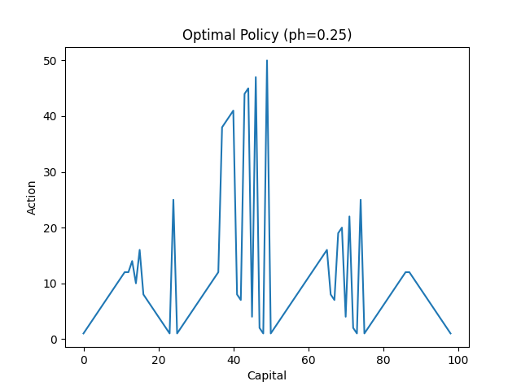
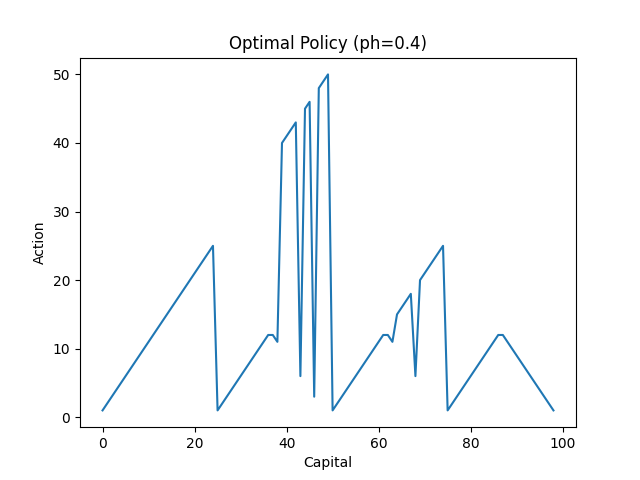
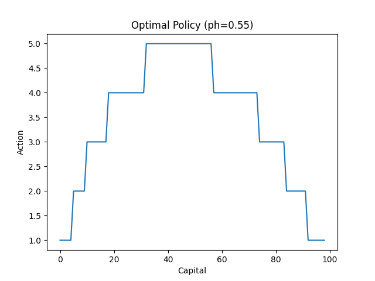
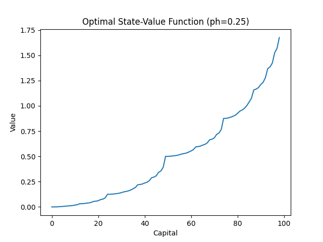
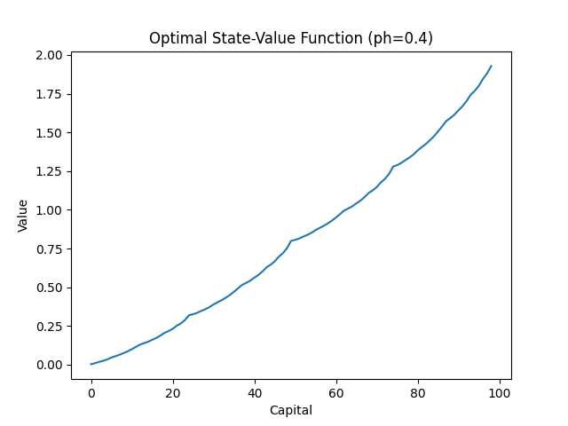
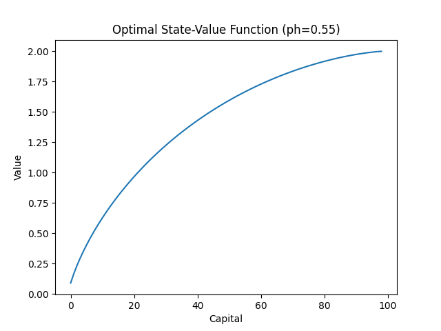

# Gambler’s Problem – Value Iteration (Reinforcement Learning)

## 📖 Problem Statement

This project implements **the Gambler’s Problem** from Sutton & Barto’s *Reinforcement Learning: An Introduction* (2nd Edition), using **Value Iteration** to compute the optimal policy and state-value function.

A gambler bets on a sequence of **coin flips**:

* On **heads**, the gambler wins the stake.
* On **tails**, the gambler loses the stake.
* The game ends when the gambler reaches a goal of **$100** or loses everything.

Formulation as an **MDP**:

* **States**: Current capital s ∈ {1, 2, …, 99} 
* **Actions**: Stakes a ∈ {0, 1, …, min(s, 100 − s)}.
* **Rewards**: 0 on all transitions, except reaching $100 which yields **+1**.
* **Termination**: At states (s = 0) or (s = 100).

The **state-value function** represents the probability of eventually reaching $100 from each state. The **optimal policy** is the betting strategy that maximizes this probability.

---

## ⚙️ Method

We solve the problem using **Value Iteration**:

1. Initialize the value function for all states.
2. Iteratively update values using the Bellman optimality equation.
3. Derive the greedy policy with respect to the final value function.
4. Repeat for different probabilities of heads (p_h).

We introduce two dummy terminal states ((s=0) and (s=100)) with values fixed at 0 and 1.

---

## 📊 Results

### Policies

For different values of the coin bias (p_h), the greedy policies derived from the value function exhibit distinct shapes:

* **(p_h = 0.25) and (p_h = 0.40):**
  The plotted policies appear irregular (jagged) across capital states. This effect does **not** imply instability in the algorithm. It is largely explained by **ties or near-ties in the action values**: for many states, multiple actions yield nearly identical returns, and the deterministic argmax selection can flip between them due to tiny numerical differences. As a result, different but equally optimal actions are chosen across states, producing the jagged appearance.
  In practice, this means the optimal policy is **not unique** in these cases, and there exists a *family of equally good solutions*.

* **(p_h = 0.55):**
  The policy has a much clearer, smoother structure. Since heads are more likely, larger stakes are favored near mid-range capital states. Here the optimal action is more distinct across states, so the policy curve looks more stable and interpretable.

---

### Value Functions

* As (p_h) increases, the slope of the value function steepens. With higher probability of winning, states further from the goal still retain significant value, leading to a sharper increase toward the target capital.
* For lower (p_h), the value function rises more gradually, reflecting the higher risk of losing and slower expected progression toward the goal.

Overall, the value function converges reliably across all cases. The irregularity observed in some policies arises from **action-value ties**, not from failure of convergence.

---

## ✅ Key Insights

* When **(p_h < 0.5)**, the optimal policies may look jagged due to ties in action values; multiple equally optimal policies exist.
* When **(p_h > 0.5)**, the policies stabilize into clearer strategies, typically with larger stakes around mid-range capitals.
* The **value functions** confirm intuition: higher (p_h) means a steeper increase in success probability with increasing capital.
* This project demonstrates how **value iteration** handles ties in the Bellman updates, leading to entire families of optimal policies rather than a single unique one.
