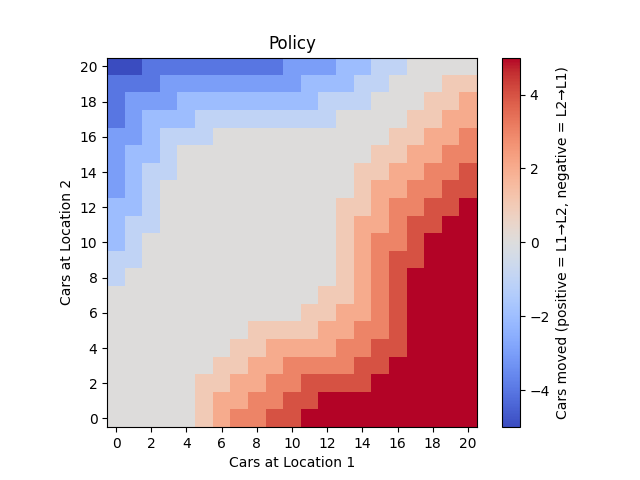
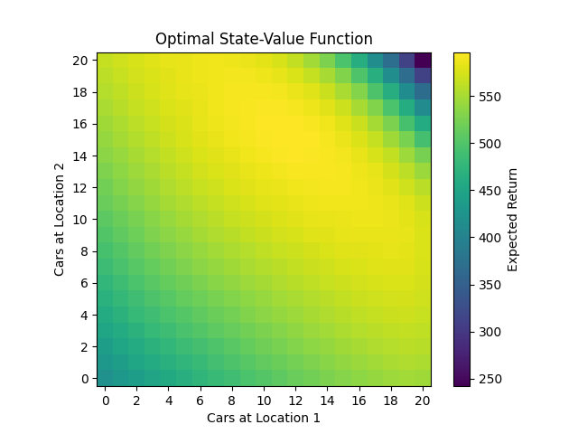

# Jack’s Car Rental – Policy Iteration (Reinforcement Learning)

## 📖 Problem Statement
This project implements **Example 4.2 (Jack’s Car Rental)** from Sutton & Barto’s *Reinforcement Learning: An Introduction* (2nd Edition).

Jack manages **two car rental locations**.  
- Each day, customers arrive to rent cars.  
- If cars are available → Jack earns **$10 per rental**.  
- If no cars are available → demand is lost.  
- Cars are returned the next day (according to Poisson distributions).  
- Overnight, Jack may move cars between locations at a cost of **$2 per car moved**.  
- Each location can hold a **maximum of 20 cars**.  
- At most **5 cars can be moved per night**.  
- Discount factor: **γ = 0.9**.

The task is to formulate this as a **Markov Decision Process (MDP)** and solve it using **Policy Iteration** to find the optimal strategy for moving cars.

---

## ⚙️ Method
We use the **Policy Iteration algorithm**:
1. **Policy Evaluation**  
   Iteratively compute the state-value function \(V(s)\) under the current policy.
2. **Policy Improvement**  
   For each state, update the action (cars moved) that maximizes expected return.
3. **Repeat** until the policy converges to the optimal policy \(\pi^*\).

---

## 📊 Results

### Optimal Policy
The learned policy specifies **how many cars to move overnight** between locations, depending on the number of cars at each site.



- **Red**: Move cars from Location 1 → Location 2.  
- **Blue**: Move cars from Location 2 → Location 1.  
- **Gray**: No movement.  

The policy balances car distribution to maximize rentals and minimize wasted returns.

---

### Optimal Value Function
The state-value function shows the **expected long-term return** for each state.



- Maximum values occur **not at (20,20)** but around **balanced mid-range states (~10–15 cars each)**.  
- This reflects that too many cars → wasted returns, too few cars → lost rentals.  

---

## 📂 Directory Structure
```
JACK'S CAR PROBLEM/                # Root project directory
│
├── algorithm/                     # Contains RL algorithms and policy definition
│   ├── __init__.py                # Makes this a Python package
│   ├── policy_iteration.py        # Policy Iteration algorithm (evaluation + improvement loop)
│   └── policy.py                  # Policy class (state → action mapping, update logic)
│
├── env/                           # Environment definition for Jack's Car Rental
│   ├── __init__.py                # Makes this a Python package
│   ├── environment.py             # CarRentalEnv class (states, actions, rewards, transitions)
│   └── poisson_cache.py           # Utility for caching Poisson probabilities (performance optimization)
│
├── images/                        # Visualization outputs (plots for documentation/presentation)
│   ├── policy.png                 # Heatmap of optimal policy (cars moved between locations)
│   └── value_function.png         # Heatmap of optimal state-value function
│
├── utils/                         # Utility functions (helpers for plotting, logging, etc.)
│   ├── __init__.py                # Makes this a Python package
│   └── visualization.py           # Plotting functions for policy/value heatmaps
│
├── weights/                       # Stored run artifacts (learned weights/policies)
│   └── __init__.py                # Placeholder so directory is importable (can be optional)
│
├── main.py                        # Entry point to run the whole project (training + saving + plotting)
├── requirements.txt               # Python dependencies needed to run the project
└── test                           # Placeholder for tests (recommend renaming to tests/ with __init__.py)

```

---

## ▶️ Running the Project
```bash
python main.py   --policy_plot_file_path images/policy.png   --value_function_plot_file_path images/value_function.png   --policy_data_file_path weights/policy.npy   --value_data_file_path weights/value_function.npy
```

---

## ✅ Key Insights
- The optimal policy **does not hoard cars** — instead it keeps cars balanced and allows room for returns.  
- The value function demonstrates that **flexibility (space to accept returns)** can be more valuable than **having maximum cars in stock**.  
- This project shows how **dynamic programming** (policy iteration) solves real-world resource allocation problems in reinforcement learning.

---
