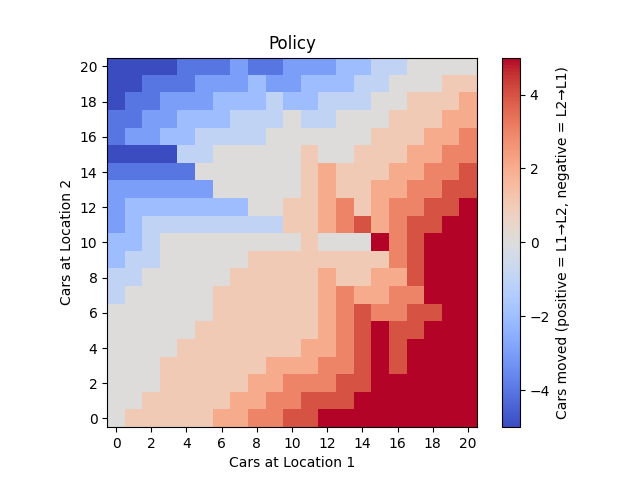
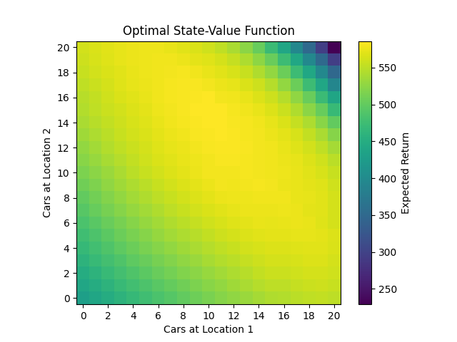

# Jack’s Car Rental – Policy Iteration (Reinforcement Learning)

## 📖 Problem Statement
This project implements **Jack’s Car Rental** from Sutton & Barto’s *Reinforcement Learning: An Introduction* (2nd Edition), using **Policy Iteration** to solve the resource allocation problem.

Jack manages **two car rental locations**.  
- Each day, customers arrive to rent cars.  
- If cars are available → Jack earns **$10 per rental**.  
- If no cars are available → demand is lost.  
- Cars are returned the next day (Poisson-distributed).  
- Overnight, Jack may move cars between locations at a cost.  
- Each location has limited capacity.  
- Discount factor: **γ = 0.9**.

We study **two versions** of the problem:  
1. **Problem I (Original)** – Basic version as described in Example 4.2 of Sutton & Barto.  
2. **Problem II (Modified)** – With additional constraints:  
   - Free move: One car from Location 1 → Location 2 can be moved for free.  
   - Parking cost: Keeping **>10 cars overnight** at any location incurs a **$4 cost**.  

---

## ⚙️ Method
We solve both problems using **Policy Iteration**:
1. **Policy Evaluation**  
   Iteratively compute the state-value function \(V(s)\) under the current policy.  
2. **Policy Improvement**  
   Update the policy greedily with respect to expected returns.  
3. **Repeat** until convergence.

---

## 📊 Results

### Problem I – Original Setup
The learned policy balances car distribution while accounting for move costs.  

**Optimal Policy (Problem I):**


- **Red** = Move cars from Location 1 → Location 2  
- **Blue** = Move cars from Location 2 → Location 1  
- **Gray** = No movement  

**Optimal Value Function (Problem I):**


- Highest values occur when cars are **balanced between locations**, not at maximum capacity.  
- Shows the tradeoff between keeping cars available vs. leaving room for returns.  

---

### Problem II – Modified Setup
With the **free move** and **parking penalty**, the learned strategy changes noticeably:

**Optimal Policy (Problem II):**


- There is a stronger **bias towards moving cars from Location 1 → Location 2**, since the **first car is free**.  
- Policy avoids leaving **>10 cars** at either location, to prevent the **$4 parking penalty**.  

**Optimal Value Function (Problem II):**


- The maximum expected returns shift further **towards balanced states with ≤10 cars** per location.   

---

## 📂 Directory Structure
```
JACK'S CAR PROBLEM/                # Root project directory
│
├── algorithm/                     # Contains RL algorithms and policy definition
│   ├── __init__.py                # Makes this a Python package
│   ├── policy_iteration.py        # Policy Iteration algorithm (evaluation + improvement loop)
│   └── policy.py                  # Policy class (state → action mapping, update logic)
│
├── env/                           # Environment definition for Jack's Car Rental
│   ├── __init__.py                # Makes this a Python package
│   ├── environment.py             # CarRentalEnv class (states, actions, rewards, transitions)
│   └── poisson_cache.py           # Utility for caching Poisson probabilities (performance optimization)
│
├── images/                        # Visualization outputs (plots for documentation/presentation)
│   ├── policy.png                 # Heatmap of optimal policy (cars moved between locations)
│   └── value_function.png         # Heatmap of optimal state-value function
│
├── utils/                         # Utility functions (helpers for plotting, logging, etc.)
│   ├── __init__.py                # Makes this a Python package
│   └── visualization.py           # Plotting functions for policy/value heatmaps
│
├── weights/                       # Stored run artifacts (learned weights/policies)
│   └── policy.npy                 # Storing learned policy as numpy array
│   └── value_function.npy         # Storing learned value function as numpy array
│
├── main.py                        # Entry point to run the whole project (training + saving + plotting)
├── requirements.txt               # Python dependencies needed to run the project
└── tests                          
│   └── checking_policy.ipynb      # Exploring the optimal policy.

```

---

## ▶️ Running the Project

1. Create and activate a virtual environment:
```bash
python3 -m venv env
source env/bin/activate
```

2. Install dependencies:
```bash
pip install -r requirements.txt
```

3. Run policy iteration:
```bash
python3 main.py   --policy_plot_file_path images/policy.png   --value_function_plot_file_path images/value_function.png   --policy_data_file_path weights/policy.npy   --value_data_file_path weights/value_function.npy
```

---

## ✅ Key Insights
- **Problem I:** Optimal strategy keeps cars balanced while minimizing unnecessary moves.  
- **Problem II:** Free moves encourage bias towards Location 2, while the parking penalty forces states to stay under the **10-car limit** at both locations.  
- This demonstrates how small real-world nonlinearities (free perks, storage costs) can lead to significant changes in the **optimal RL policy**.  
